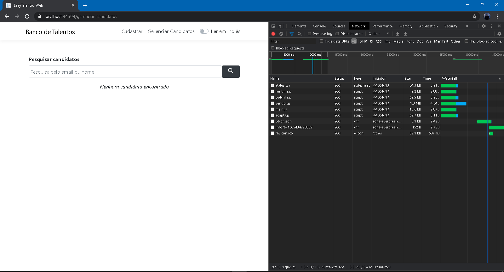
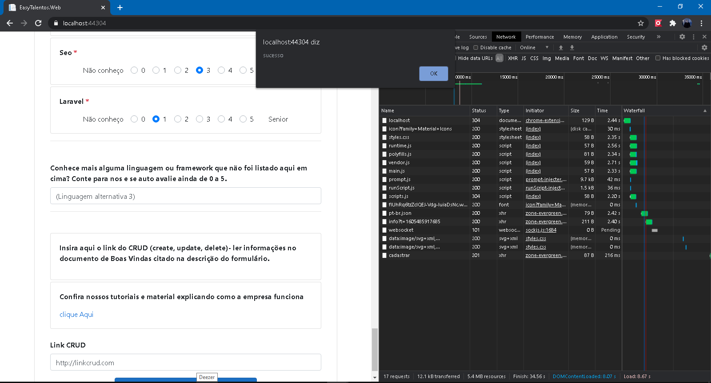
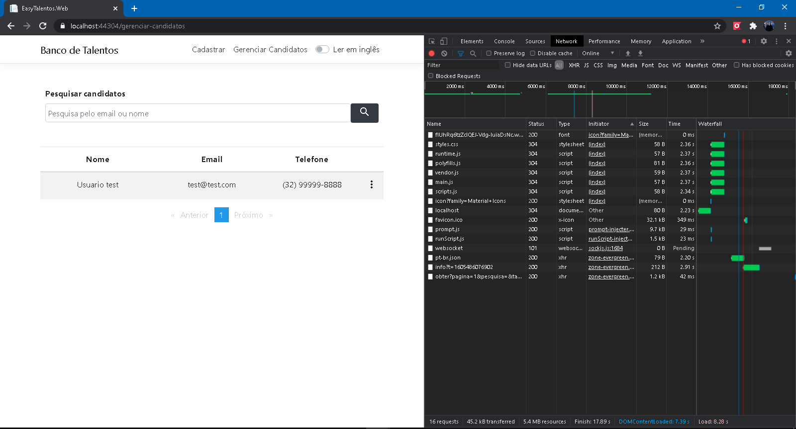
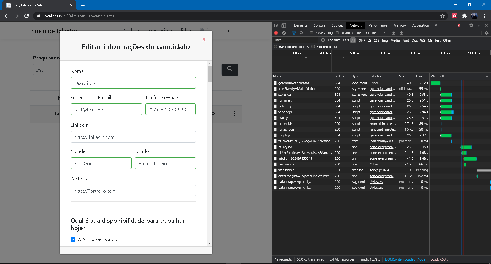
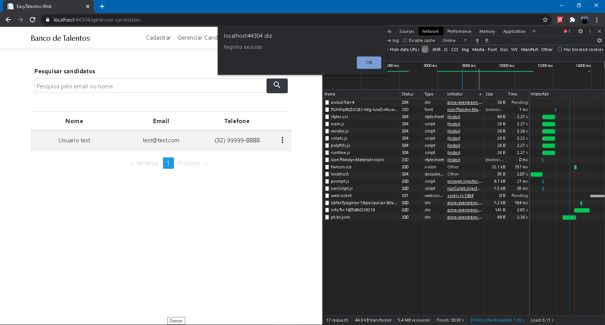
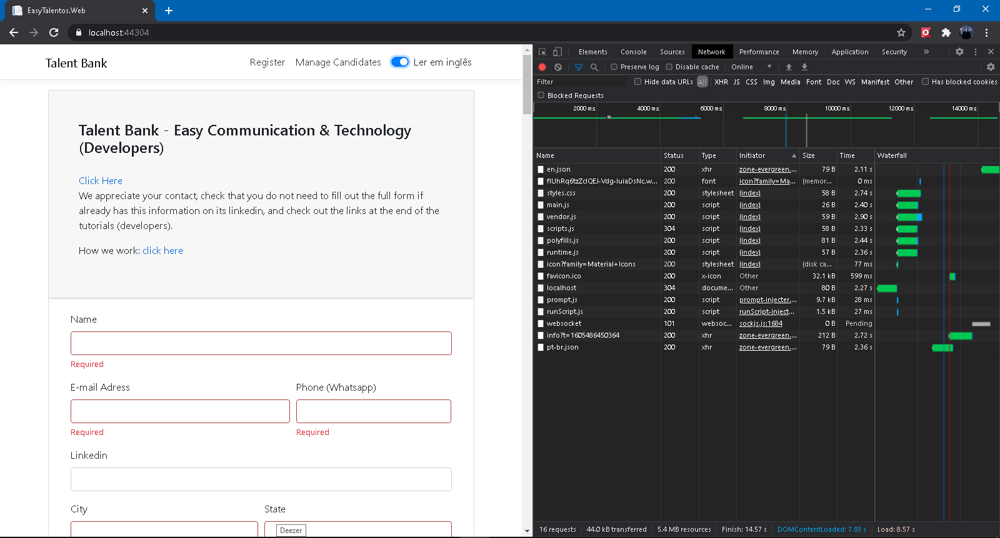
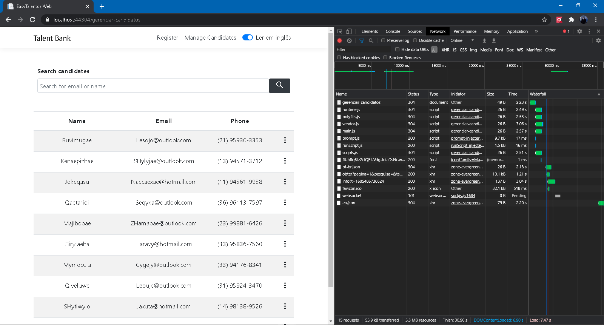
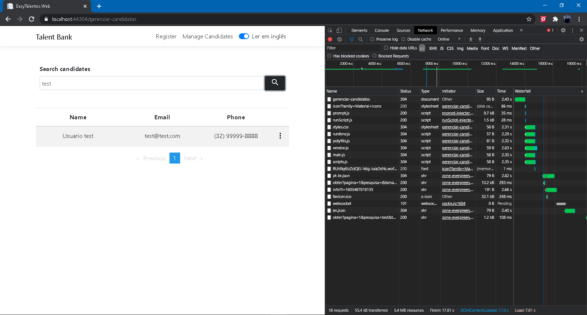

<h1>Projeto Teste Easy</h1>

<ul>
<li>Asp Net Web Api</li>
<li>EF Core</li>
<li>Angular</li>
<li>Bootstrap</li>

<h5>Para testes</h5>

<li>MSTest</li>
<li>Protactor</li>
</ul>

<h1>Capturas de tela</h1>

<h3>Lista de candidatos com banco vazio</h3>

<h3>Cadastrando candidato</h3>
<h5>(Screenshot sem alert em /prints/cadastrando-candidato-2.PNG/)</h5>

<h3>Lista de candidatos com registro</h3>

<h3>Editando candidato</h3>

<h3>Excluindo candidato</h3>

<h3>Alternar para inglês (Funcionalidade)</h3>

<h5>(Listagem em inglês)</h5>

<h3>Buscando candidato</h3>

